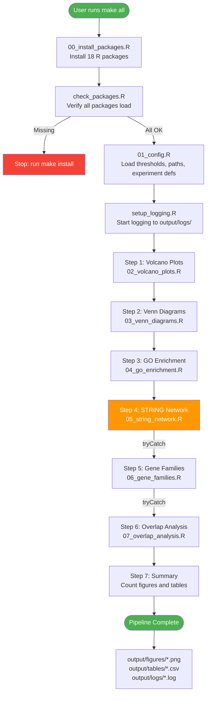
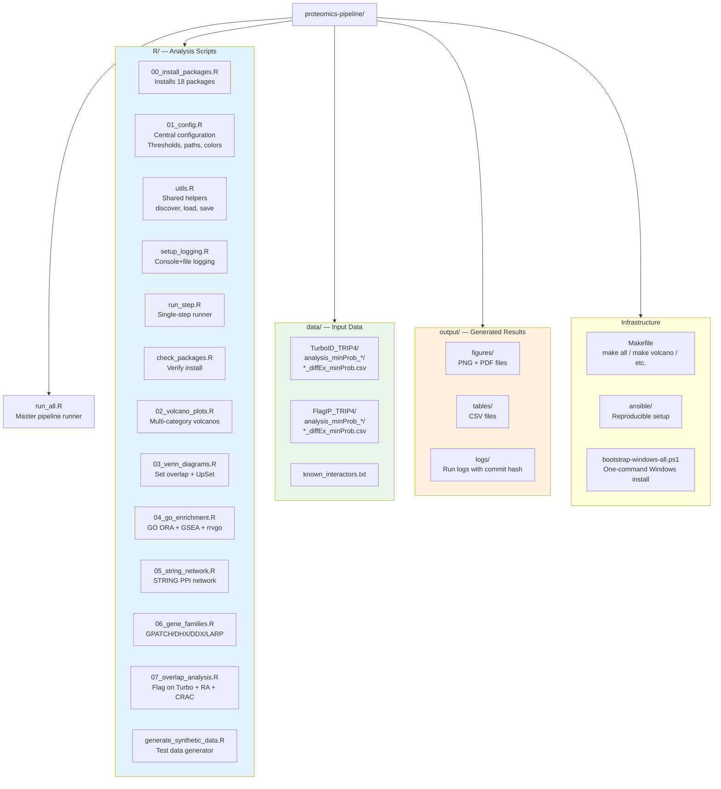
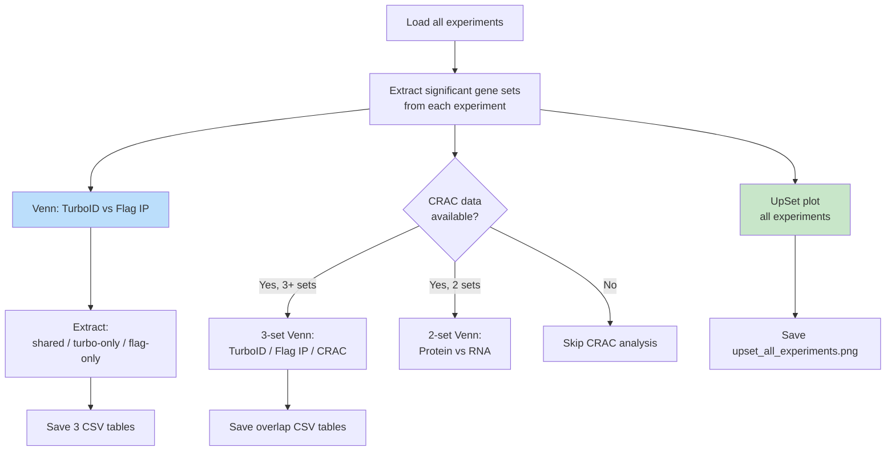
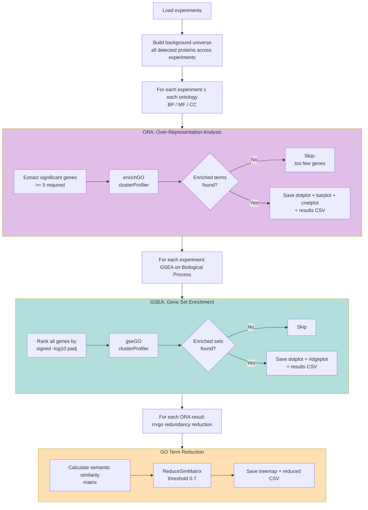
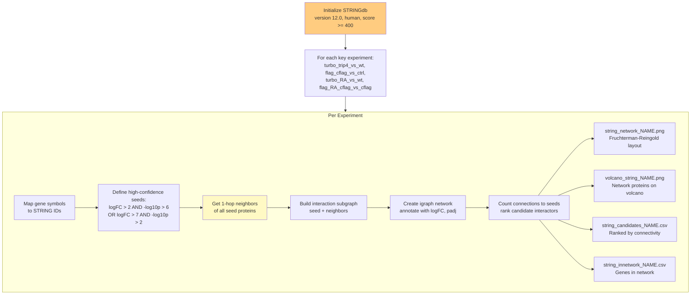
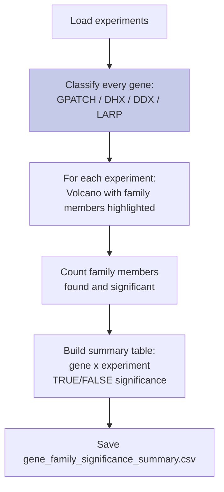
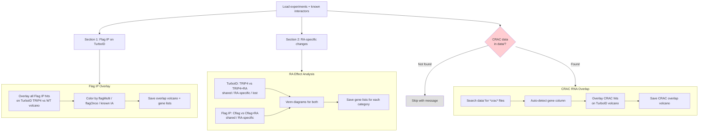
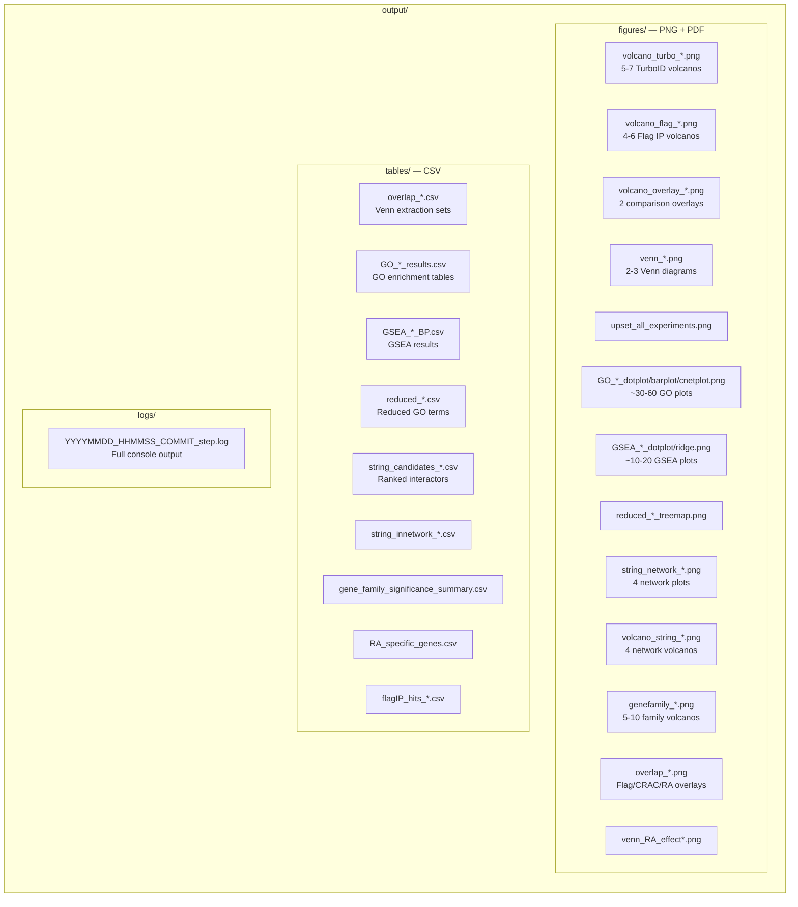

# TRIP4/ASCC Proteomics Pipeline — Architecture

## Table of Contents
1. [Pipeline Overview](#1-pipeline-overview)
2. [Data Flow](#2-data-flow)
3. [File Structure](#3-file-structure)
4. [Step-by-Step Logic](#4-step-by-step-logic)
5. [Timing & Duration](#5-timing--duration)
6. [Output Inventory](#6-output-inventory)
7. [Configuration Reference](#7-configuration-reference)
8. [Verification Checklist](#8-verification-checklist)

---

## 1. Pipeline Overview



**Key design principles:**
- Each step is independent — can run alone via `make volcano`, `make go`, etc.
- Steps 4-6 are wrapped in `tryCatch` — if one fails, the pipeline continues
- All output is logged with git commit hash for reproducibility
- Data is never modified — read-only from `data/`

---

## 2. Data Flow

```mermaid
flowchart LR
    subgraph DATA [data/ directory]
        TURBO[data/2026-05-13_..._TurboID_TRIP4/<br/>analysis_minProb_BK467_*/<br/>*_diffEx_minProb.csv]
        FLAG[data/2026-05-13_..._FlagIP_TRIP4/<br/>analysis_minProb_BK516_*/<br/>*_diffEx_minProb.csv]
        INT[data/known_interactors.txt<br/>27 known TRIP4 interactors]
    end

    subgraph DISCOVER [discover_diffex_csvs]
        SCAN[Scan data/ recursively<br/>for *_diffEx_minProb.csv]
        DEDUP[Strip _diffEx_minProb suffix<br/>Handle duplicates __1, __2]
        SCAN --> DEDUP
    end

    subgraph LOAD [load_proteomics_csv]
        FUZZY[Fuzzy column matching<br/>Gene / logFC / adj.P.Val]
        VALIDATE[Validate + rename to<br/>gene / log2FC / padj]
        FUZZY --> VALIDATE
    end

    TURBO --> SCAN
    FLAG --> SCAN
    DEDUP --> FUZZY

    VALIDATE --> EXP1[turbo_trip4_vs_wt<br/>~3000 proteins]
    VALIDATE --> EXP2[flag_cflag_vs_ctrl<br/>~3000 proteins]
    VALIDATE --> EXPN[...up to 15 experiments]

    INT --> IA_LIST[Known interactors list<br/>ASCC1-3, TRIP4, MED1, etc.]

    EXP1 --> SIG{get_significant_genes<br/>padj < 0.05 AND |logFC| > 0.5}
    EXP2 --> SIG
    IA_LIST --> OVERLAY[Overlay on volcano plots]

    SIG --> SIG_TURBO[Sig TurboID genes]
    SIG --> SIG_FLAG[Sig Flag IP genes]
    SIG --> SIG_GO[Sig genes for GO analysis]

    style DATA fill:#E3F2FD
    style DISCOVER fill:#FFF3E0
    style LOAD fill:#F3E5F5
```

### CSV Column Mapping

The pipeline expects these columns (with fuzzy matching fallback):

| Expected Role | Config Variable | Real CSV Column | Fuzzy Alternatives Tried |
|---|---|---|---|
| Gene name | `COL_GENE` | `Gene` | gene, Gene.name, Gene.symbol, SYMBOL |
| Log2 fold change | `COL_LOG2FC` | `logFC` | log2FC, Log2FC, log2FoldChange |
| Adjusted p-value | `COL_PADJ` | `adj.P.Val` | FDR, padj, q.value |

If a column is not found, the pipeline prints a detailed error listing all available columns.

---

## 3. File Structure



---

## 4. Step-by-Step Logic

### Step 1: Volcano Plots (02_volcano_plots.R)

```mermaid
flowchart TD
    subgraph LOAD_VOL [Load Phase]
        L1[Load known_interactors.txt<br/>27 genes]
        L2[Load all experiments<br/>via load_all_experiments]
        L1 --> L2
    end

    subgraph FLAG_CATS [Build Flag IP Categories]
        F1[Find all Flag IP experiments<br/>grep '^flag_' in names]
        F2[Extract significant genes<br/>from each Flag experiment]
        F3{Count occurrences<br/>across Flag experiments]
        F4[flagMulti: in 2+ experiments<br/>flagOnce: in exactly 1]
        F1 --> F2 --> F3 --> F4
    end

    subgraph TURBO_VOL [TurboID Volcanos]
        T1[For each TurboID experiment:]
        T2[Layer 1: Base significance<br/>padj < 0.05 AND |logFC| > 0.5]
        T3[Layer 2: Gene families<br/>GPATCH / DHX / DDX / LARP]
        T4[Layer 3: Flag IP hits<br/>flagMulti → flagOnce]
        T5[Layer 4: Known interactors<br/>Highest priority label]
        T6[Layer 5: High-confidence<br/>logFC > 2 AND -log10p > 6]
        T1 --> T2 --> T3 --> T4 --> T5 --> T6
        T6 --> T7[Label all highlighted points<br/>via ggrepel]
        T7 --> T8[Save volcano_NAME.png + .pdf]
    end

    subgraph OVERLAY_VOL [Overlay Plots]
        O1[TurboID TRIP4 vs Flag IP C-Flag<br/>Side-by-side scatter]
        O2[TurboID TRIP4 vs TRIP4+RA<br/>Hormone effect comparison]
        O1 --> O3[Save overlay .png + .pdf]
        O2 --> O3
    end

    LOAD_VOL --> FLAG_CATS --> TURBO_VOL --> OVERLAY_VOL

    style T5 fill:#FFCDD2
    style T6 fill:#FFE0B2
```

**Category priority** (highest wins, overrides lower):
1. `high` — extreme significance (logFC>2 & -log10p>6)
2. `ia` — known TRIP4 interactors
3. `flagMulti` / `flagOnce` — Flag IP overlap
4. Gene families (`gp`/`dhx`/`ddx`/`LARPs`)
5. `TRUE` / `FALSE` — significant / not significant

### Step 2: Venn Diagrams (03_venn_diagrams.R)



### Step 3: GO Enrichment (04_go_enrichment.R)



### Step 4: STRING Network (05_string_network.R)



> **Note:** First run downloads ~100MB from STRING database. Subsequent runs use cache.

### Step 5: Gene Families (06_gene_families.R)



### Step 6: Overlap Analysis (07_overlap_analysis.R)



---

## 5. Timing & Duration

### Full Pipeline Timeline

```mermaid
gantt
    title Pipeline Execution Timeline (Real Data, Windows i7 laptop)
    dateFormat X
    axisFormat %s

    section Setup
    Package check           :a1, 0, 5s
    Config + logging        :a2, after a1, 2s

    section Data Loading
    Discover CSVs (recursive) :b1, after a2, 1s
    Load 10-15 CSVs         :b2, after b1, 15s

    section Step 1: Volcanos
    TurboID volcanos (5-7)  :c1, after b2, 30s
    Flag IP volcanos (4-6)  :c2, after c1, 30s
    Overlay plots (2)       :c3, after c2, 10s

    section Step 2: Venn
    Venn + UpSet plots      :d1, after c3, 10s

    section Step 3: GO Enrichment
    ORA (10 exp x 3 ont)    :e1, after d1, 120s
    GSEA (10 exp)           :e2, after e1, 180s
    rrvgo reduction         :e3, after e2, 60s

    section Step 4: STRING
    STRINGdb init (download) :f1, after e3, 300s
    Network analysis (4 exp) :f2, after f1, 120s

    section Step 5-6
    Gene families           :g1, after f2, 20s
    Overlap analysis        :g2, after g1, 15s

    section Summary
    Log + output count      :h1, after g2, 2s
```



| Step | Typical Time | Bottleneck |
|------|-------------|------------|
| Package check | 5 sec | Package loading |
| Data discovery + load | 15 sec | CSV parsing (~1.4 MB each) |
| Volcano plots | 70 sec | ggrepel label placement |
| Venn diagrams | 10 sec | — |
| GO ORA | 2-3 min | clusterProfiler enrichGO x 30 runs |
| GO GSEA | 3-4 min | gseGO ranking x 10 experiments |
| GO rrvgo | 1 min | Similarity matrix computation |
| STRING network | 5-10 min | First run: 100MB download |
| Gene families | 20 sec | — |
| Overlap analysis | 15 sec | — |
| **Total** | **12-18 min** | STRING download dominates |

---

## 6. Output Inventory



**Expected output counts (10 experiments, real data):**
- Figures: 60-90 files (PNG + PDF pairs)
- Tables: 20-40 CSV files
- Logs: 1 per run (timestamped with git commit)

---

## 7. Configuration Reference

All parameters are in `R/01_config.R`:

| Parameter | Value | Purpose |
|-----------|-------|---------|
| `P_VALUE_CUTOFF` | 0.05 | Adjusted p-value threshold (FDR) |
| `LOG2FC_CUTOFF` | 0.5 | Absolute log2 fold change threshold |
| `ORGDB` | org.Hs.eg.db | Human annotation database |
| `KEYTYPE` | SYMBOL | Gene ID format (gene symbols) |
| `STRING_TAXON` | 9606 | Human NCBI taxon ID |
| `STRING_VERSION` | 12.0 | STRING database version |
| `STRING_SCORE_THRESHOLD` | 400 | Medium confidence interactions |
| `GO_PVALUE_CUTOFF` | 0.05 | GO enrichment p-value cutoff |
| `GO_QVALUE_CUTOFF` | 0.05 | GO enrichment q-value cutoff |
| `GO_PADJUST_METHOD` | BH | Benjamini-Hochberg correction |
| `GO_ONTOLOGIES` | BP, MF, CC | All three GO domains |

### Experiment Definitions (15 total)

| Key | Real Experiment Name | System |
|-----|---------------------|--------|
| `turbo_trip4_vs_wt` | BK467_TRIP4_vs_BK467_WT | TurboID, HeLa |
| `turbo_RA_vs_trip4` | BK467_TRIP4_RA02_vs_BK467_TRIP4 | TurboID + RA |
| `turbo_RA_vs_wt` | BK467_TRIP4_RA02_vs_BK467_WT | TurboID + RA vs WT |
| `turbo_cross_467_504` | BK467_TRIP4_vs_BK504_TRIP4 | Cross-batch TurboID |
| `turbo_RA_cross` | BK467_TRIP4_RA02_vs_BK504_TRIP4_RA04 | Cross-batch RA |
| `turbo_RA04_vs_trip4` | BK504_TRIP4_RA04_vs_BK504_TRIP4 | BK504 TurboID + RA |
| `turbo_RA04_vs_wt` | BK504_TRIP4_RA04_vs_BK467_WT | BK504 vs WT |
| `flag_cflag_vs_ctrl` | BK516_Cflag_vs_BK516_Ctrl | Flag IP, HEK293 |
| `flag_nflag_vs_ctrl` | BK516_Nflag_vs_BK516_Ctrl | N-terminal Flag |
| `flag_cflag_vs_nflag` | BK516_Cflag_vs_BK516_Nflag | C vs N terminal |
| `flag_RA_cflag_vs_cflag` | BK523_Cflag_RA04_vs_BK516_Cflag | Flag IP + RA |
| `flag_RA_cflag_vs_ctrl` | BK523_Cflag_RA04_vs_BK523_Ctrl_RA04 | Flag IP + RA vs Ctrl |
| `flag_RA_cflag_vs_nflag` | BK523_Cflag_RA04_vs_BK523_Nflag_RA04 | RA C vs N |
| `flag_RA_nflag_vs_nflag` | BK523_Nflag_RA04_vs_BK516_Nflag | RA N vs N |
| `flag_RA_nflag_vs_ctrl` | BK523_Nflag_RA04_vs_BK523_Ctrl_RA04 | RA N vs Ctrl |

---

## 8. Verification Checklist

After each run, verify:

- [ ] **Log file** in `output/logs/` shows `Status: COMPLETED` at the end
- [ ] **Volcano plots** show dashed threshold lines and labeled highlighted points
- [ ] **Venn diagram** shows overlap count between TurboID and Flag IP
- [ ] **GO enrichment** produced dotplots with enriched GO terms (not empty)
- [ ] **STRING network** shows connected nodes (not empty graph)
- [ ] **Gene families** show GPATCH/DHX/DDX/LARP labeled in different colors
- [ ] **Overlap analysis** shows Flag IP hits overlaid on TurboID volcano
- [ ] **No ERROR lines** in the log file (search for "ERROR" or "FAILED")

### Common Issues

| Symptom | Cause | Fix |
|---------|-------|-----|
| 0 experiments loaded | No `*_diffEx_minProb.csv` in subdirs | Check data folder structure |
| COLUMN ERROR | Column names differ | Check log for available columns, edit `01_config.R` |
| GO enrichment empty | Too few significant genes (<5) | Relax thresholds or add more data |
| STRING network empty | Too few high-confidence seeds | Lower STRING_SCORE_THRESHOLD in config |
| `make` not found | Windows PATH issue | Use full Rscript path or fix PATH |
