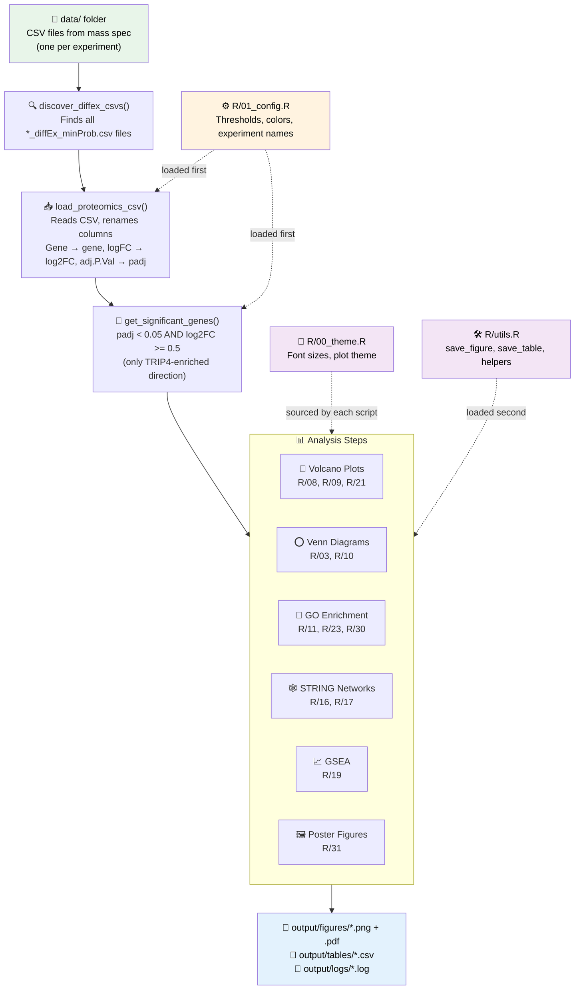
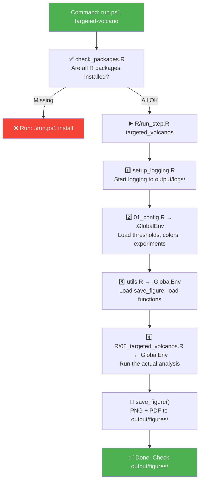
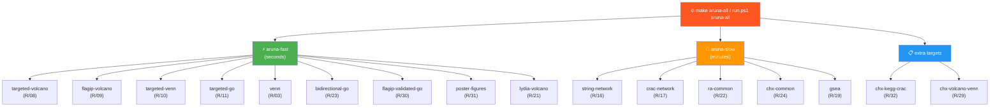
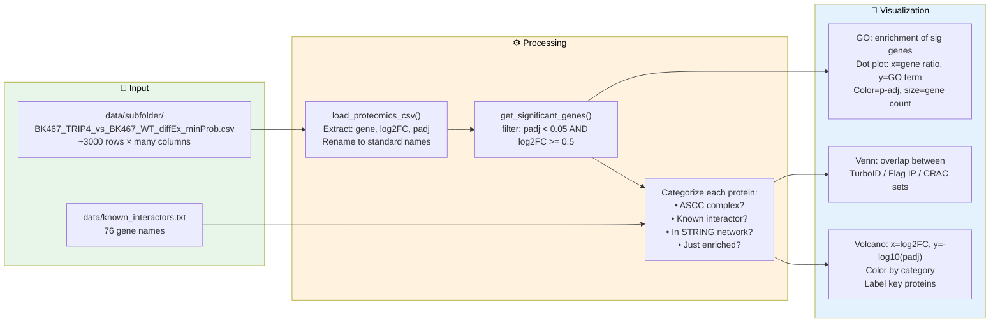

# Proteomics Pipeline — Handover Guide for Self-Maintenance

**Goal of this document:** Give you everything you need to understand, run, and modify this pipeline WITHOUT depending on AI or a developer.

---

## Table of Contents

1. [What This Pipeline Does](#1-what-this-pipeline-does)
2. [How to Run It](#2-how-to-run-it)
3. [Architecture Diagrams](#3-architecture-diagrams)
4. [File Map — Where to Find What](#4-file-map--where-to-find-what)
5. [Common Modifications You Might Want to Make](#5-common-modifications-you-might-want-to-make)
6. [Plot Standards Reference](#6-plot-standards-reference)
7. [What We Changed (July 2026)](#7-what-we-changed-july-2026)
8. [Troubleshooting](#8-troubleshooting)
9. [R Cheat Sheet](#9-r-cheat-sheet-for-this-codebase)
10. [Glossary](#10-glossary)

---

## 1. What This Pipeline Does

This pipeline analyzes mass spectrometry data from experiments studying the
TRIP4 protein and the ASCC complex (Activating Signal Cointegrator 1 Complex).
TRIP4 is a transcription coactivator that also plays a role in RNA processing.

The pipeline takes CSV files from differential expression analysis (DIA-NN +
limma output), where each row is a protein with:
- **Gene name** (e.g., "TRIP4")
- **Log2 fold change** (how much more/less abundant in the experiment vs control)
- **Adjusted p-value** (statistical confidence that the change is real)

It then produces publication-quality figures:
- **Volcano plots** — scatter plots showing every protein, colored by significance
- **Venn diagrams** — showing overlap between experiments
- **GO enrichment dot plots** — showing which biological functions are over-represented
- **STRING network plots** — showing physical protein-protein interactions
- **GSEA plots** — ranked gene set enrichment analysis
- **Bidirectional GO plots** — up-regulated vs down-regulated side by side

The pipeline supports multiple experiment types:
- **TurboID** — proximity labeling in HeLa cells (what's near TRIP4?)
- **Flag IP** — co-immunoprecipitation in HEK293 cells (what binds TRIP4?)
- **CRAC** — UV cross-linking RNA interactome data (what RNA does TRIP4 touch?)
- **CHX/DMSO** — cycloheximide translation inhibitor experiments
- **RA** — retinoic acid treatment conditions

---

## 2. How to Run It

### On Dr. Aruna's Windows Laptop (make.exe is blocked)

Use the PowerShell runner instead of `make`:

```powershell
cd C:\Users\aruna\GitHub\proteomics-pipeline
git pull

.\run.ps1 aruna-fast       # Quick analyses + poster figures (~30 seconds)
.\run.ps1 aruna-slow       # STRING networks + GSEA (~5-10 minutes)
.\run.ps1 aruna-all        # Everything
.\run.ps1 diagnostics      # Print data summary (counts, no sensitive values)
.\run.ps1 help             # See all available targets
```

### On a Linux/Mac Machine (make works normally)

```bash
cd ~/proteomics-pipeline
git pull

make aruna-fast            # Quick analyses + poster figures
make aruna-slow            # STRING networks + GSEA
make aruna-all             # Everything
make diagnostics           # Data summary
make help                  # See all targets
```

### What Each Command Produces

| Command | Output Location | What's in it |
|---------|----------------|--------------|
| `aruna-fast` | `output/figures/` | Volcano plots, Venn diagrams, GO dot plots, poster figures |
| `aruna-slow` | `output/figures/` | STRING network plots, GSEA enrichment curves |
| `aruna-all` | `output/figures/` + `output/tables/` | Everything above + CSV tables |
| `poster-figures` | `poster/figures/` | Standardized poster-quality PDF+PNG versions |

---

## 3. Architecture Diagrams

### Pipeline Overview



### How a Single Step Runs

When you type `.\run.ps1 targeted-volcano` (or `make targeted-volcano`):



### Make Target Tree



### Data Flow: CSV → Plot



---

## 4. File Map — Where to Find What

### Infrastructure (You Rarely Change These)

| File | What It Does | When You'd Touch It |
|------|-------------|-------------------|
| `Makefile` | Defines all `make` targets | Adding a new analysis step |
| `run.ps1` | PowerShell replacement for `make` (Windows) | Same — must stay in sync with Makefile |
| `run_all.R` | Master runner (runs everything sequentially) | Rarely |
| `R/run_step.R` | Runs a single analysis step by name | Adding a new step (register here!) |
| `R/setup_logging.R` | Captures console output to log files | Never |
| `R/check_packages.R` | Verifies R packages are installed | Adding a new package dependency |
| `R/00_install_packages.R` | Installs all required R packages | Adding a new package |
| `tests/test_pipeline_structure.py` | Basic structure tests (keeps git hooks happy) | Never |

### Configuration (You Change These)

| File | What It Does | When You'd Touch It |
|------|-------------|-------------------|
| `R/01_config.R` | **ALL thresholds, paths, experiment names, colors** | Changing significance cutoffs, colors, adding experiments |
| `R/00_theme.R` | Font sizes, plot themes, figure dimensions | Changing font sizes, plot styling |
| `R/utils.R` | Save functions, data loading, file discovery | Rarely — changing how files are saved |
| `data/known_interactors.txt` | List of known TRIP4 interactors | Adding/removing genes from the highlight list |

### Analysis Scripts (You Change These for New Analyses)

| File | What It Does | Make Target |
|------|-------------|------------|
| **Volcano Plots** | | |
| `R/02_volcano_plots.R` | Multi-category volcanos (all experiments) | `make volcano` |
| `R/08_targeted_volcanos.R` | 3 custom volcanos: TRIP4 vs WT, RA effects | `make targeted-volcano` |
| `R/09_flagip_volcano.R` | TurboID volcano with Flag IP overlap labels | `make flagip-volcano` |
| `R/21_lydia_network_volcano.R` | STRING network overlay on volcano (Lydia's method) | `make lydia-volcano` |
| `R/29_chx_volcano_venn.R` | CHX vs DMSO volcano + Venn | `make chx-volcano-venn` |
| **Venn Diagrams** | | |
| `R/03_venn_diagrams.R` | Standard Venn + UpSet plot | `make venn` |
| `R/10_targeted_venns.R` | RA effect Venn + TurboID vs Flag Venn | `make targeted-venn` |
| **GO Enrichment** | | |
| `R/04_go_enrichment.R` | GO ORA on all experiments | `make go` |
| `R/11_targeted_go.R` | GO on 3 key gene sets (BP/MF/CC) | `make targeted-go` |
| `R/23_bidirectional_go.R` | Up vs Down GO in one plot | `make bidirectional-go` |
| `R/27_bidirectional_go_ra.R` | -RA vs +RA conditions GO | `make bidirectional-go-ra` |
| `R/30_flagip_validated_go.R` | GO on triple-validated interactors | `make flagip-validated-go` |
| **STRING Networks** | | |
| `R/05_string_network.R` | Original STRING PPI network | `make string` |
| `R/16_string_network_targeted.R` | Lydia-style: seeds → neighbor expansion | `make string-network` |
| `R/17_crac_string_network.R` | STRING network for CRAC RNA data | `make crac-network` |
| `R/28_string_style_network.R` | STRING website-style bubble network | `make string-style-network` |
| **Cross-Experiment** | | |
| `R/22_ra_common_analysis.R` | Common proteins across RA concentrations | `make ra-common` |
| `R/24_chx_common_analysis.R` | CHX/DMSO enriched/depleted + STRING + GO | `make chx-common` |
| `R/26_network_go_comparison.R` | GO for in-network vs not-in-network | `make network-go` |
| `R/32_chx_kegg_crac_overlap.R` | KEGG + GO on CHX + CRAC overlap | `make chx-kegg-crac` |
| **Other** | | |
| `R/19_gsea.R` | Gene Set Enrichment Analysis | `make gsea` |
| `R/31_poster_figures.R` | Re-plots from pre-computed tables with poster fonts | `make poster-figures` |
| `R/diagnostics.R` | Prints structural data summary (counts only) | `make diagnostics` |

---

## 5. Common Modifications You Might Want to Make

This is the most important section. Each subsection tells you exactly which
file to open, what to change, and what the result will be.

### 5A. Change a Color

**File:** `R/01_config.R`, around line 140

**Variable:** `GLOBAL_COLORS`

The colors are defined as hex codes (e.g., `"#0072B2"` is deep navy blue).
You can look up hex codes at htmlcolorcodes.com or use any color picker.

```r
# CURRENT (in the file):
GLOBAL_COLORS <- c(
  "ascc_core"     = "#0072B2",   # Deep Navy — ASCC complex
  "known_ia"      = "#009E73",   # Bluish Green — known interactors
  "enriched_up"   = "#D55E00",   # Vermillion Orange — enriched in TRIP4
  ...
)

# TO CHANGE: just edit the hex code. Example — make ASCC complex red:
GLOBAL_COLORS <- c(
  "ascc_core"     = "#FF0000",   # Changed to red
  ...
)
```

**IMPORTANT:** Some scripts use `GLOBAL_COLORS[["key"]]` (double brackets —
correct) and some use `CATEGORY_COLORS` (a separate legacy list for the old
R/02 volcano plots). Check which one your target script uses.

**Where the colors appear:** Volcano plots, Venn diagrams, and any plot that
references `GLOBAL_COLORS`.

---

### 5B. Change Significance Thresholds

**File:** `R/01_config.R`, lines 35-36

```r
# CURRENT:
P_VALUE_CUTOFF    <- 0.05     # 5% false discovery rate
LOG2FC_CUTOFF     <- 0.5      # ~1.4-fold change minimum
```

**What each means:**
- `P_VALUE_CUTOFF`: How confident we need to be. 0.05 = "5% chance this is a
  false positive." Lower (0.01) = stricter, fewer proteins. Higher (0.1) =
  more permissive, more proteins.
- `LOG2FC_CUTOFF`: Minimum fold change. 0.5 = ~1.4-fold change. 1.0 = 2-fold
  change. Lower = more proteins pass. Higher = fewer, more dramatic changes.

**Changing these affects EVERYTHING** — volcano plot thresholds, Venn diagram
sets, GO enrichment gene lists, STRING network inputs. The number of proteins
in every analysis will change. This is expected.

**Example:** Stricter thresholds
```r
P_VALUE_CUTOFF    <- 0.01     # Stricter: 1% FDR
LOG2FC_CUTOFF     <- 1.0      # 2-fold change minimum
```

---

### 5C. Change Font Sizes

**File:** `R/00_theme.R`, line 103

The `theme_poster()` function takes a `font_size` parameter:

```r
# CURRENT (line 103):
theme_poster <- function(base_family = "sans", font_size = 15) {
```

Change `15` to any number. Every figure that uses `theme_poster()` updates.

**For volcano plots specifically:** Volcano plots override the legend to 10pt
because the legend is positioned inside the plot. Look in `R/08_targeted_volcanos.R`,
`R/09_flagip_volcano.R`, and `R/21_lydia_network_volcano.R` for:

```r
legend.text  = ggplot2::element_text(size = 10),   # ← Change this number
legend.title = ggplot2::element_text(size = 10, face = "bold")
```

**For GO dot plots:** The axis text is separately overridden to 22pt. Look
for:
```r
ggplot2::theme(axis.text = ggplot2::element_text(size = 22, color = "black"))
```

**History:** Font size went through many iterations: 24 → 20 → 18 → 16 → 14 → 15
(settled). Don't re-litigate unless Aruna specifically requests it.

---

### 5D. Add or Remove a Known Interactor

**File:** `data/known_interactors.txt`

Format: One gene name per line. Lines starting with `#` are comments.

```
# Known TRIP4 interactors (updated July 2026)
TRIP4
ASCC1
ASCC2
ASCC3
MED1
...
```

Just add or remove a line. The pipeline reads this file at runtime and prints
`Loaded N known interactors` — check that number in the log to confirm it
picked up your change.

**IMPORTANT:** This file is tracked by git despite being in `data/` (which is
otherwise gitignored). There's a `.gitignore` exception: `!data/known_interactors.txt`.
If you accidentally delete it, recover it:
```bash
git log --oneline -- data/known_interactors.txt
git show <hash>:data/known_interactors.txt > data/known_interactors.txt
```

---

### 5E. Add a New Experiment

**File:** `R/01_config.R`, starting at line 98

The `EXPERIMENTS` list maps short names to actual CSV filenames:

```r
EXPERIMENTS <- list(
  turbo_trip4_vs_wt      = "BK467_TRIP4_vs_BK467_WT",
  # ... add a new one:
  new_experiment         = "ACTUAL_CSV_FILENAME_WITHOUT_SUFFIX",
)
```

**Rules:**
- Left side: short name you'll reference in scripts (use underscores)
- Right side: the actual filename from mass spec, WITHOUT the
  `_diffEx_minProb.csv` suffix
- The CSV must be placed somewhere under `data/` — the pipeline finds it
  automatically by scanning recursively

After adding, run `.\run.ps1 diagnostics` to verify the pipeline finds your
new experiment.

---

### 5F. Modify Volcano Plot Colors and Labels

**File:** `R/08_targeted_volcanos.R` (for targeted volcanos)

Volcano plots assign each protein a category, then color by category. The
categories are built up in layers (highest priority overrides lower):

1. ASCC complex member → blue (`#0072B2`)
2. Known interactor → green (`#009E73`)
3. Flag IP validated → various
4. Enriched (significant) → orange (`#D55E00`)
5. Not significant → grey (`#D0D0D0`)

To change a category's color, find the `scale_color_manual` call and change
the hex value. To change which proteins get labeled, modify the `label_genes`
variable or the labeling condition.

**For the Lydia volcano** (STRING network overlay): the categories are more
complex. See `R/21_lydia_network_volcano.R`. The 7 categories and their
colors are documented in the script comments.

---

### 5G. Modify GO Dot Plot Appearance

GO dot plots use a standardized recipe across all GO scripts. The recipe is:

```r
# 1. Create the dotplot first
p <- dotplot(result, showCategory = n_show)

# 2. Extract gene counts BEFORE adding scales (create-then-modify pattern)
cnt <- p$data$Count

# 3. Apply the standard scales
p <- p +
  scale_color_gradient(low = "#D55E00", high = "#0072B2",
                       name = "p-adjusted value") +
  scale_size_continuous(name = "Gene Count", range = c(3, 10),
                        breaks = make_size_breaks(cnt, n_breaks = 8),
                        limits = c(min(cnt), max(cnt))) +
  scale_y_discrete(labels = capitalize_first) +
  guides(size = size_legend_guide()) +
  labs(x = "Gene Ratio") +
  theme_poster() +
  ggplot2::theme(axis.text =
    ggplot2::element_text(size = 22, color = "black"))
```

**What each line does:**
- `scale_color_gradient`: Orange (low p-adj = significant) → blue (high p-adj).
  Without this, dots can appear BLACK at certain p-value ranges.
- `scale_size_continuous`: Dot size = gene count. Range 3-10mm. 8 legend
  circles from data minimum to maximum.
- `capitalize_first`: Capitalizes the first letter of each GO term.
- `size_legend_guide()`: Makes size legend circles render grey (not black).
- `theme_poster()`: Standard font sizes.
- `axis.text = 22`: Large axis text so GO terms are readable.

**These helpers come from `R/00_theme.R`** — any script using them must
`source("R/00_theme.R")` at the top.

---

### 5H. Change Figure Dimensions

**Where:** Each script calls `save_figure()` with width/height:

```r
save_figure(plot, "my_figure", width = 16, height = 12)  # inches
```

Current standard dimensions:
- Volcano plots: **16 × 12 inches** (was 8×6 — too small for poster fonts)
- GO dot/bar plots: **18 wide, height = max(14, n_terms × 0.8)** inches
- Bidirectional GO: **18 × 14 inches**
- Venn diagrams: **10 × 8 inches**
- STRING networks: **12 × 10 inches**

Larger is better for posters — vector PDFs stay sharp at any size. When
Aruna resizes them in PowerPoint, the text stays crisp.

---

### 5I. Add a Completely New Analysis Step

This requires changes in **THREE** files. Follow this checklist:

**Step 1: Write the R script** — `R/33_your_analysis.R`

```r
# Always start with library() calls for EVERY package you use:
library(ggplot2)
library(dplyr)

# Config and utils are already loaded — you can use:
#   P_VALUE_CUTOFF, LOG2FC_CUTOFF, GLOBAL_COLORS, EXPERIMENTS
#   load_all_experiments(), get_significant_genes(), save_figure(), save_table()

# If you use theme_poster(), source the theme file:
source("R/00_theme.R")

# Load data
experiments <- load_all_experiments()
df <- find_experiment(experiments, "turbo_trip4_vs_wt")

# Get significant genes
sig_genes <- get_significant_genes(df)

# ... your analysis code ...

# Save output
save_figure(my_plot, "my_analysis_result", width = 16, height = 12)
save_table(result_df, "my_analysis_table")
```

**Step 2: Register in `R/run_step.R`** (TWO places!)

```r
# Place 1 — valid_steps vector (~line 23):
valid_steps <- c("volcano", "venn", ...,
                 "your_analysis")           # ADD

# Place 2 — step_scripts list (~line 41):
step_scripts <- list(
  ...
  your_analysis = "R/33_your_analysis.R"    # ADD
)
```

**Step 3: Add to Makefile AND run.ps1**

Makefile:
```makefile
your-analysis: check clean-old ## Your description here
	$(RSCRIPT) R/run_step.R your_analysis
```

run.ps1 (add to `$singleTargets`):
```powershell
$singleTargets = @{
    ...
    "your-analysis" = "your_analysis"
}
```

**Common mistake:** Forgetting step 2. If you get "Unknown step" error, you
forgot to register in run_step.R.

---

### 5J. Change the Known Interactors File Location

If you need to point to a different interactors file:

**File:** The script that loads it. Most scripts call:
```r
interactors <- load_known_interactors(
  file.path(DATA_DIR, "known_interactors.txt")
)
```

Change the filename argument. But keeping it at `data/known_interactors.txt`
is strongly recommended — it's gitignored except for this specific file.

---

## 6. Plot Standards Reference

### Colors (Okabe-Ito Colorblind-Safe Palette)

These are the ONLY colors used across the pipeline. They are colorblind-safe
and print well in black & white.

| Purpose | Name | Hex Code |
|---------|------|----------|
| ASCC complex | Deep Navy | `#0072B2` |
| Known interactors | Bluish Green | `#009E73` |
| Enriched in TRIP4 | Vermillion | `#D55E00` |
| Enriched in WT | Light Grey | `#8C8C8C` |
| Not significant | Pale Grey | `#D0D0D0` |
| Both Flag-validated | Bluish Green | `#009E73` |
| C-Flag only | Deep Navy | `#0072B2` |
| N-Flag only | Muted Mauve | `#CC79A7` |
| Enriched in CHX | Vermillion | `#D55E00` |
| Enriched in DMSO | Dark Plum | `#882255` |
| In STRING network | Teal | `#1B9E77` |
| Highly enriched | Red | `#E41A1C` |

### Plot Rules

1. **ALL CIRCLES** — no triangles, squares, or diamonds. Ever.
2. **Labels:** Only known interactors + ASCC core. Do not over-label.
3. **No experiment numbers in titles** — "TRIP4 vs WT" not "BK467_TRIP4_vs_BK467_WT"
4. **GO barplots:** Sort by p-adjusted (NOT by count). Similar-significance
   terms should be adjacent for comparison.
5. **GO dot plots:** Explicit `scale_color_gradient(low="#D55E00", high="#0072B2")`
   on EVERY dot plot. Default enrichplot colors produce black dots.
6. **GO dot plot size legend:** 8 circles, constant step from data min to max.
   Use `make_size_breaks()` helper.
7. **Volcano legend:** Inside plot at top-left, 10pt text. White background.
8. **Bidirectional GO legend:** Inside plot, legend dot size = 5.
9. **Capitalize first letter** of every GO term description.

### Figure Dimensions

| Figure Type | Width × Height (inches) |
|-------------|------------------------|
| Volcano plots | 16 × 12 |
| GO dot/bar plots | 18 × max(14, n_terms × 0.8) |
| Bidirectional GO | 18 × 14 |
| Venn diagrams | 10 × 8 |
| STRING networks | 12 × 10 |

---

## 7. What We Changed (July 2026)

### Bug Fixes

1. **abs(log2FC) direction bug** — The `get_significant_genes()` function
   used `abs()` which treated WT-enriched proteins (negative log2FC) as
   TRIP4-enriched. This caused mitochondrial protein artifacts in GO analysis.
   Fixed: now defaults to `direction="enriched"` (positive log2FC only).

2. **GO universe fix** — GO enrichment was using all genes from all 19
   experiments as the background. Fixed: now uses only genes detected in the
   specific experiment being analyzed.

3. **Floating point threshold** — Protein FXR1 had log2FC=1.0 in the CSV but
   R stored it as 0.9999999. Changed `>` to `>=` in threshold checks.

### New Features

4. **theme_poster()** — Single font theme applied to all plots. Change one
   number → all figures update. Eliminates font size inconsistency.

5. **Bidirectional GO dot plots** (R/23, R/27) — Up-regulated on the right,
   down-regulated on the left, in a single figure. Signed GeneRatio technique.

6. **CHX/DMSO analysis** (R/24, R/29, R/32) — Cycloheximide translation
   inhibitor experiments get the same analysis structure as RA treatment:
   volcano, Venn, STRING network, bidirectional GO, KEGG.

7. **Flag IP validated GO** (R/30) — GO enrichment on proteins validated by
   BOTH C-Flag AND N-Flag IP (triple-validated highest-confidence interactors).

8. **Poster figures consolidation** (R/31) — Re-plots from pre-computed
   tables with standardized fonts. `aruna-fast` now includes this automatically.

9. **Lydia volcano simplification** (R/21) — Reduced from 9 categories to 7
   clean categories. Gene families (GPATCH/DHX/DDX/LARP) removed from the
   network volcano — they belong only in R/06.

10. **PowerShell runner** (run.ps1) — Replaces make.exe on Windows where
    Application Control blocks it.

11. **GO dot plot standardization** — 8 legend circles, consistent color
    gradient, grey size legend circles, capitalized GO terms. Applied
    uniformly across R/11, R/23, R/30, R/31.

---

## 8. Troubleshooting

### "make.exe failed to run: Application Control policy has blocked this file"

**Cause:** Windows Application Control blocks make.exe.
**Fix:** Use `.\run.ps1` instead of `make`. See section 2.

### "Error: Unknown step 'xxx'"

**Cause:** The step was added to the Makefile but not registered in
`R/run_step.R`.
**Fix:** Add the step name to BOTH `valid_steps` (vector) AND `step_scripts`
(list) in `R/run_step.R`.

### "Column 'logFC' doesn't exist"

**Cause:** Using the raw CSV column name instead of the standardized name.
**Fix:** The pipeline renames columns: `logFC` → `log2FC`, `adj.P.Val` →
`padj`, `Gene` → `gene`. Always use the standardized names (`df$log2FC`,
`df$padj`, `df$gene`) in your code.

### "could not find function 'element_rect'"

**Cause:** Missing `ggplot2::` prefix when using `sys.source()`.
**Fix:** Use `ggplot2::element_rect()` instead of bare `element_rect()`.
Or add `library(ggplot2)` at the top of the script.

### "could not find function 'STRINGdb'" or similar

**Cause:** Missing `library()` call. Scripts loaded via `sys.source()` don't
inherit package attachments.
**Fix:** Add `library(STRINGdb)` (or whatever package) at the top of the
script. Only add packages you ACTUALLY use — unused library calls crash if
the package isn't installed.

### "system cannot find the path specified" (Windows)

**Cause:** The Makefile's Rscript auto-detection ran Unix commands.
**Fix:** This should be fixed (Makefile checks `ifeq ($(OS),Windows_NT)`
first). If it recurs, check the RSCRIPT variable block at the top of the
Makefile.

### Black dots in GO dot plot

**Cause:** enrichplot's default color scale produces black dots at certain
p-value ranges.
**Fix:** Add explicit `scale_color_gradient(low="#D55E00", high="#0072B2")`
to every dotplot. Never rely on enrichplot defaults.

### STRINGdb "incorrect number of dimensions"

**Cause:** Two possible causes: (1) input is a tibble instead of data.frame,
(2) cache directory path issue on Windows.
**Fix:** Use `as.data.frame(df)` before calling `$map()`. Pass a persistent
cache path like `file.path(OUTPUT_DIR, "string_cache")`.

### "replacement has 3 rows, data has 4"

**Cause:** `guide_legend(override.aes = list(size = c(4, 7, 10)))` — the
vector length doesn't match the number of legend entries.
**Fix:** Don't pass explicit size vectors to `override.aes`. Use
`override.aes = list(color = "#D55E00")` instead (single value, no matching
issue).

### OneDrive + git = lost history

**CRITICAL:** If the repo is inside `C:\Users\aruna\OneDrive\...`, git objects
can become "online-only" stubs. OneDrive uninstall or sync failure = lost
history. The repo should live at a path OUTSIDE OneDrive, like
`C:\Users\aruna\GitHub\proteomics-pipeline`.

**If this has already happened:** Clone fresh from GitHub to recover code.
Data files may be recoverable from onedrive.live.com.

---

## 9. R Cheat Sheet (for This Codebase)

R uses specific syntax that may be unfamiliar. Here's what you'll see:

### Assignment: `<-`

```r
x <- 5           # "x gets the value 5" (same as x = 5 but more idiomatic)
name <- "TRIP4"  # Text goes in quotes
```

### Column Access: `$`

```r
df$gene          # The "gene" column from the data frame "df"
df$log2FC        # The "log2FC" column
df$padj < 0.05   # TRUE/FALSE for each row: is padj below 0.05?
```

### Combining Values: `c()`

```r
genes <- c("TRIP4", "ASCC1", "ASCC2")  # A vector (list) of gene names
colors <- c("red" = "#FF0000", "blue" = "#0000FF")  # Named vector
```

### Functions: `function()`

```r
# Define:
add_numbers <- function(a, b) {
  result <- a + b
  return(result)
}

# Call:
add_numbers(3, 4)   # Returns 7
```

### Lists: `list()` and `[[name]]`

```r
# Create:
experiments <- list(
  exp1 = data_frame_1,
  exp2 = data_frame_2
)

# Access:
experiments$exp1          # Single bracket — returns a list of one element
experiments[["exp1"]]     # Double bracket — returns the actual data frame
experiments[[1]]          # By position
```

**CRITICAL:** `colors["key"]` returns a NAMED value. `colors[["key"]]` returns
just the value. Using single brackets inside `scale_color_manual()` causes a
silent bug where colors don't match. Always use double brackets.

### Membership: `%in%`

```r
"TRIP4" %in% df$gene      # Is "TRIP4" in the gene column? TRUE/FALSE
df$gene %in% interactors  # Vector of TRUE/FALSE for each row
```

### Loading Code: `source()` and `sys.source()`

```r
source("R/00_theme.R")                    # Loads a file into the current environment
sys.source("R/01_config.R", envir = .GlobalEnv)  # Loads into global environment specifically
```

The pipeline uses `sys.source()` with `.GlobalEnv` so that functions loaded
from config.R and utils.R are visible to subsequent scripts.

### Namespace Prefix: `package::`

```r
ggplot2::ggplot(...)       # Use ggplot from the ggplot2 package
ggplot2::element_text(...) # Explicitly from ggplot2
```

This is needed when a package isn't attached via `library()` but you still
need one of its functions.

### Vectorized Conditional: `ifelse()`

```r
# Applies to every row at once:
df$category <- ifelse(df$log2FC > 0, "Up", "Down")
```

---

## 10. Glossary

| Term | Meaning |
|------|---------|
| **Volcano plot** | Scatter plot: x = log2 fold change, y = -log10(p-value). Each dot = one protein. |
| **log2FC** | Log2 fold change. How much protein abundance changed. +1 = 2-fold up, -1 = 2-fold down, 0 = no change. |
| **padj** | Adjusted p-value (False Discovery Rate). How confident we are the change is real. Lower = more confident. |
| **FDR** | False Discovery Rate. The fraction of "significant" results that are actually false positives. |
| **GO enrichment** | Gene Ontology enrichment. Tests whether genes in a biological process are over-represented in your significant proteins. |
| **ORA** | Over-Representation Analysis. Uses only significant genes (needs a cutoff). |
| **GSEA** | Gene Set Enrichment Analysis. Uses ALL genes ranked by a metric (no cutoff needed). More sensitive for subtle changes. |
| **STRING** | Search Tool for the Retrieval of Interacting Genes. Database of known/predicted protein-protein interactions. |
| **TurboID** | Proximity labeling technique. Biotin ligase fused to TRIP4 labels nearby proteins. |
| **Flag IP** | Flag-tag immunoprecipitation. Antibody pulls down TRIP4 + whatever is bound to it. |
| **CRAC** | Cross-linking and Analysis of cDNAs. UV crosslinks protein to RNA to find direct RNA contacts. |
| **ASCC** | Activating Signal Cointegrator 1 Complex. TRIP4's protein complex (ASCC1, ASCC2, ASCC3, TRIP4). |
| **CHX** | Cycloheximide. Translation inhibitor — freezes ribosomes on mRNA. |
| **DMSO** | Dimethyl sulfoxide. Vehicle control for CHX treatment. |
| **RA** | Retinoic acid. Hormone treatment condition. |
| **Okabe-Ito palette** | Colorblind-safe 8-color palette designed for scientific publications. |
| **enrichGO** | clusterProfiler function that runs ORA on GO terms. |
| **gseGO** | clusterProfiler function that runs GSEA on GO terms. |
| **STRINGdb** | R package that interfaces with the STRING database. |
| **DIA-NN** | Software that processes raw mass spectrometry data into protein quantities. |
| **limma** | R package for differential expression analysis (the pipeline that produces the input CSVs). |

---

## Quick Reference Card

```
RUN:        .\run.ps1 aruna-fast     (Windows)
            make aruna-fast           (Linux/Mac)

UPDATE:     git pull

COLORS:     R/01_config.R → GLOBAL_COLORS (line ~140)
THRESHOLDS: R/01_config.R → P_VALUE_CUTOFF, LOG2FC_CUTOFF (line ~35)
FONTS:      R/00_theme.R → theme_poster(font_size = 15) (line ~103)
GENES:      data/known_interactors.txt (one per line)
OUTPUT:     output/figures/ (PNG + PDF)
TABLES:     output/tables/ (CSV)
LOGS:       output/logs/ (with git commit hash)

NEW STEP:   (1) R/NN_name.R
            (2) R/run_step.R (BOTH valid_steps + step_scripts)
            (3) Makefile + run.ps1

PRIVATE REPO — GitHub only. Never push to ngit.
```
