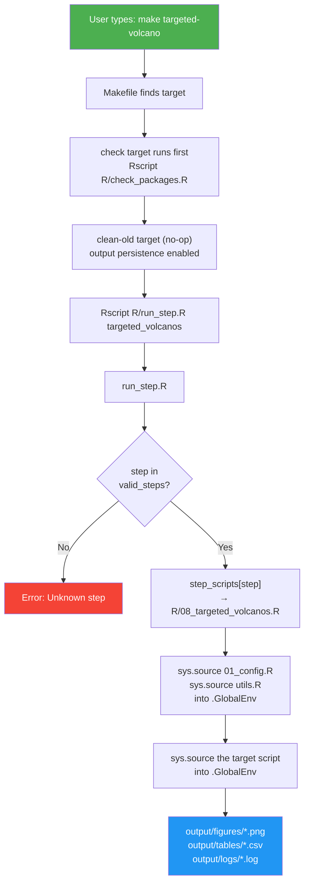
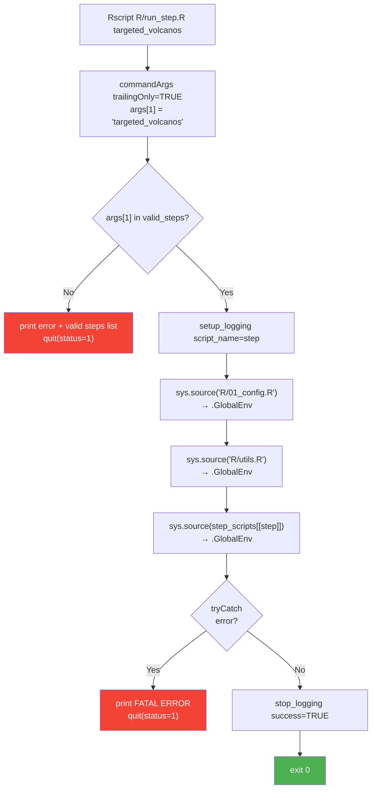

# Handover: How to Create Functional Make Targets for This Pipeline

## Audience
This document is for AI assistants / developers who need to add or modify
Make targets for the proteomics-pipeline R project. It documents the exact
patterns that produce working targets on both Windows (Aruna's laptop) and
Linux (dev machine).

---

## The Error Being Fixed

Dr. Aruna's Windows machine blocks `make.exe` via Application Control policy:

```
Program 'make.exe' failed to run: An Application Control policy has blocked this file
```

**The solution deployed:** A `run.ps1` PowerShell script that replaces `make`
entirely. It calls `Rscript R/run_step.R <step_name>` directly. No make.exe
needed. Aruna runs `.\run.ps1 aruna-fast` instead of `make aruna-fast`.

**WSL is NOT needed.** The PowerShell runner handles everything. If a future
LLM suggests WSL, point them at this file — it's overkill.

---

## Architecture: How a Make Target Runs an R Script



---

## The 3-Part Registration Pattern (CRITICAL)

When you add a new analysis script, you MUST register it in **THREE** places.
Missing ANY of them causes a failure. This bug has occurred repeatedly.

### Part 1: Write the R Script

Create `R/NN_description.R`. The number prefix controls execution order in
`run_all.R` but NOT in make targets (make runs steps individually).

```r
# R/33_new_analysis.R
library(ggplot2)
library(dplyr)
# ... other libraries you actually use

# Config + utils are already loaded by run_step.R into .GlobalEnv
# before this script runs. So P_VALUE_CUTOFF, GLOBAL_COLORS,
# load_all_experiments(), save_figure() etc. are all available.

df <- load_all_experiments()
# ... your analysis code ...

save_figure(my_plot, "new_analysis_result")
```

**MUST:** Call `library()` for EVERY non-base package you use, even though
config/utils are pre-loaded. Scripts loaded via `sys.source()` into
`.GlobalEnv` do NOT inherit package attachments from other scripts.

### Part 2: Register in run_step.R (TWO places!)

File: `R/run_step.R`

You must add the step to BOTH the `valid_steps` vector AND the
`step_scripts` list. Missing one or the other produces different errors:

```r
# Place 1: valid_steps vector (line ~23)
valid_steps <- c("volcano", "venn", ...,
                 "new_analysis")        # ← ADD HERE

# Place 2: step_scripts list (line ~41)
step_scripts <- list(
  volcano  = "R/02_volcano_plots.R",
  # ... existing entries ...
  new_analysis = "R/33_new_analysis.R"  # ← AND HERE
)
```

**If you forget valid_steps:** `Error: Unknown step 'new_analysis'`
**If you forget step_scripts:** `subscript out of bounds`

**Verify after editing:**
```bash
grep -c new_analysis R/run_step.R  # should print 2
```

### Part 3: Add the Makefile Target

File: `Makefile`

```makefile
new-analysis: check clean-old ## Description of what it does
	$(RSCRIPT) R/run_step.R new_analysis
```

**Pattern rules:**
- Target name uses **hyphens** (`new-analysis`), step name uses **underscores** (`new_analysis`)
- Every analysis target depends on `check clean-old`
- The recipe is ALWAYS `$(RSCRIPT) R/run_step.R <step_name>`
- The tab character before `$(RSCRIPT)` is MANDATORY (Make requires tabs, not spaces)

---

## Group Targets Pattern

Group targets chain multiple sub-targets. Example from the actual Makefile:

```makefile
aruna-fast: targeted-volcano flagip-volcano targeted-venn targeted-go \
            venn bidirectional-go flagip-validated-go poster-figures lydia-volcano
	@echo ""
	@echo "================================================"
	@echo " FAST ANALYSIS + POSTER FIGURES COMPLETE"
	@echo "================================================"
```

Key points:
- Group targets list sub-targets as prerequisites (space-separated)
- Line continuation with `\` (backslash at end of line)
- The recipe (the `@echo` lines) runs AFTER all prerequisites complete
- `@` before a command suppresses echoing the command itself

---

## The RSCRIPT Variable (Cross-Platform)

```mermaid
flowchart TD
    START["Make starts"] --> OS{"OS == Windows_NT?"}
    OS -->|Yes| WIN['RSCRIPT = "C:/Program Files/R/R-4.6.1/bin/Rscript.exe"']
    OS -->|No| UNIX["Try: command -v Rscript<br/>→ /usr/lib/R/bin/Rscript<br/>→ /home/*/.local/bin/Rscript<br/>→ fallback: 'Rscript'"]
    WIN --> TARGET["Run target recipe"]
    UNIX --> TARGET

    style WIN fill:#f44336,color:#fff
    style OS fill:#FF9800,color:#fff
```

The Makefile detects the OS FIRST and hardcodes the Windows path. This
prevents the "system cannot find the path specified" error that occurs when
Unix shell detection commands run on Windows cmd.exe.

**If Aruna's R version changes** (e.g., R-4.7.0), update the Windows path
in the Makefile AND the detection logic in `run.ps1`.

---

## The clean-old Target (Currently a No-Op)

```makefile
clean-old:
	@echo "  clean-old: skipped (output persistence enabled)"
```

Previously this deleted old output files before each run. Aruna requested
that ALL files persist across runs (for comparison). The target still exists
as a dependency but does nothing. Do not remove it — too many targets
reference it.

---

## The run.ps1 PowerShell Runner

Since make.exe is blocked on Aruna's machine, `run.ps1` provides the same
functionality. When adding a new Make target, you MUST also add the
equivalent entry to `run.ps1`:

### For single-step targets:

Add to the `$singleTargets` hash table in `run.ps1`:

```powershell
$singleTargets = @{
    # ... existing entries ...
    "new-analysis" = "new_analysis"   # ← ADD: make-name → step-name
}
```

### For group targets:

Add to the `$groupTargets` hash table:

```powershell
$groupTargets = @{
    # ... existing entries ...
    "new-group" = @(
        "step_one",
        "step_two",
        "step_three"
    )
}
```

**IMPORTANT:** When you add a Makefile target, ALWAYS update run.ps1 too.
If you don't, Aruna can run it via `make` but not via `.\run.ps1`, and she
can't use `make` (blocked by policy).

---

## run_step.R: How It Works



### Why sys.source into .GlobalEnv?

`sys.source(file, envir = .GlobalEnv)` loads the script's functions and
variables into the global environment. This makes them visible to the NEXT
script that gets sourced. If you used `local=TRUE` or a custom environment,
functions from config.R wouldn't be visible to the analysis script.

### The loading order is fixed:

1. `R/setup_logging.R` — starts capturing console output to a log file
2. `R/01_config.R` — all thresholds, colors, experiment defs, helper functions
3. `R/utils.R` — save_figure, load_all_experiments, discover_diffex_csvs
4. The target script (e.g., `R/08_targeted_volcanos.R`)

`R/00_theme.R` is NOT auto-loaded. Any script that uses `theme_poster()` must
explicitly `source("R/00_theme.R")` at its top.

---

## Complete File Reference: Script → Step → Make Target

| R Script | Step Name (run_step.R) | Make Target | run.ps1 Key |
|---|---|---|---|
| `R/02_volcano_plots.R` | `volcano` | `make volcano` | `volcano` |
| `R/03_venn_diagrams.R` | `venn` | `make venn` | `venn` |
| `R/04_go_enrichment.R` | `go` | `make go` | `go` |
| `R/05_string_network.R` | `string` | `make string` | — |
| `R/06_gene_families.R` | `families` | `make families` | — |
| `R/07_overlap_analysis.R` | `overlap` | `make overlap` | — |
| `R/08_targeted_volcanos.R` | `targeted_volcanos` | `make targeted-volcano` | `targeted-volcano` |
| `R/09_flagip_volcano.R` | `flagip_volcano` | `make flagip-volcano` | `flagip-volcano` |
| `R/10_targeted_venns.R` | `targeted_venns` | `make targeted-venn` | `targeted-venn` |
| `R/11_targeted_go.R` | `targeted_go` | `make targeted-go` | `targeted-go` |
| `R/16_string_network_targeted.R` | `string_network` | `make string-network` | `string-network` |
| `R/17_crac_string_network.R` | `crac_string_network` | `make crac-network` | `crac-network` |
| `R/19_gsea.R` | `gsea` | `make gsea` | `gsea` |
| `R/20_pathway_network.R` | `pathway_network` | `make pathway-network` | `pathway-network` |
| `R/21_lydia_network_volcano.R` | `lydia_network_volcano` | `make lydia-volcano` | `lydia-volcano` |
| `R/22_ra_common_analysis.R` | `ra_common` | `make ra-common` | `ra-common` |
| `R/23_bidirectional_go.R` | `bidirectional_go` | `make bidirectional-go` | `bidirectional-go` |
| `R/24_chx_common_analysis.R` | `chx_common_analysis` | `make chx-common` | `chx-common` |
| `R/26_network_go_comparison.R` | `network_go` | `make network-go` | `network-go` |
| `R/27_bidirectional_go_ra.R` | `bidirectional_go_ra` | `make bidirectional-go-ra` | `bidirectional-go-ra` |
| `R/28_string_style_network.R` | `string_style_network` | `make string-style-network` | `string-style-network` |
| `R/29_chx_volcano_venn.R` | `chx_volcano_venn` | `make chx-volcano-venn` | `chx-volcano-venn` |
| `R/30_flagip_validated_go.R` | `flagip_validated_go` | `make flagip-validated-go` | `flagip-validated-go` |
| `R/31_poster_figures.R` | `poster_figures` | `make poster-figures` | `poster-figures` |
| `R/32_chx_kegg_crac_overlap.R` | `chx_kegg_crac_overlap` | `make chx-kegg-crac` | `chx-kegg-crac` |
| `R/diagnostics.R` | `diagnostics` | `make diagnostics` | `diagnostics` |

---

## Common Makefile Mistakes (From Experience)

### 1. Spaces instead of tabs
Make requires TAB characters before recipe lines. If your editor inserts
spaces, you get `*** missing separator. Stop.`

### 2. Forgetting run_step.R registration
Adding a Makefile target but not the step in run_step.R → "Unknown step" error.
This has happened at least 5 times. Always grep both lists.

### 3. Not updating run.ps1
Make target works on dev machine but Aruna can't use it → "Unknown target"
in PowerShell. Always update both.

### 4. Hardcoded thresholds instead of config constants
Using `>= 1` instead of `>= LOG2FC_CUTOFF` in the R script. The config says
0.5 but the code uses 1.0. Proteins silently disappear from results.
Always grep for hardcoded numbers.

### 5. Missing library() calls
Scripts loaded via sys.source don't inherit package attachments. Every
script that uses ggplot2, dplyr, STRINGdb, igraph etc. must call
`library(packagename)` at the top.

---

## Group Target Definitions (Current)

```
aruna-fast:  targeted-volcano, flagip-volcano, targeted-venn, targeted-go,
             venn, bidirectional-go, flagip-validated-go, poster-figures,
             lydia-volcano

aruna-slow:  lydia-volcano, string-network, crac-network,
             ra-common, chx-common, gsea

aruna-all:   aruna-fast + aruna-slow + chx-kegg-crac + chx-volcano-venn
```

---

## Checklist: Adding a New Analysis Step

```
[ ] 1. Write R/NN_name.R with library() calls at top
[ ] 2. Add step to valid_steps vector in R/run_step.R
[ ] 3. Add step to step_scripts list in R/run_step.R
[ ] 4. Verify: grep -c new_step_name R/run_step.R  → should be 2
[ ] 5. Add Makefile target with check clean-old deps
[ ] 6. Add entry to $singleTargets in run.ps1
[ ] 7. If it's part of a group, add to the group in both Makefile AND run.ps1
[ ] 8. Test on Linux: make new-target
[ ] 9. Commit + push: git add -A && git commit && git push
[ ] 10. Tell Aruna: git pull, then .\run.ps1 new-target
```
